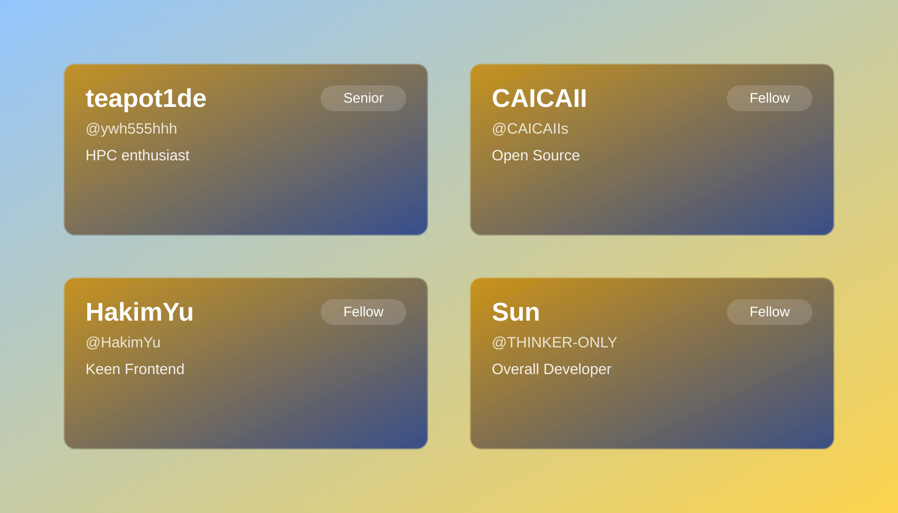

# friend-cards
> 使用Github工作流动态生成 GitHub 好友列表图片，为你的个人主页增添光彩。

这是一个为你的 GitHub 个人主页生成动态好友圈图片的工具。**核心特色是使用 GitHub Actions 工作流自动生成**，你只需要修改 JSON 文件，GitHub 会自动运行脚本并生成最新的好友列表图片。

## 🚀 核心特性

- **🔄 GitHub Actions 自动化**: 通过 GitHub 工作流自动生成图片，无需本地环境
- **📝 简单配置**: 只需修改 `friends.json` 文件，提交后自动触发生成
- **🎨 精美设计**: 生成带有渐变和动画效果的 SVG/PNG 图片
- **👥 自动获取头像**: 自动从 GitHub 获取用户头像
- **⚡ 实时更新**: 每次提交都会触发重新生成，保持图片最新

## 📋 GitHub Actions 工作流

### 工作流触发
- 当 `assets/friends/friends.json` 文件发生更改时自动触发
- 支持手动触发（在 Actions 页面手动运行）
- 定时触发（可选，保持图片定期更新）

### 工作流步骤
1. **检出代码**: 获取最新的代码
2. **设置 Node.js**: 配置 Node.js 20.x 环境
3. **安装依赖**: 使用 pnpm 安装项目依赖
4. **生成图片**: 运行 `pnpm run friends:generate` 生成图片
5. **提交更新**: 自动提交生成的图片文件

## 🛠️ **本地开发**设置

### 1. 克隆项目

```bash
git clone https://github.com/your-username/friend-cards.git
cd friend-cards
```

### 2. 安装依赖

确保你已经安装了 Node.js (>=20.0.0) 和 pnpm。

```bash
pnpm install
```

### 3. 配置 GitHub Token (本地开发需要)

为了避免达到 GitHub API 的速率限制，建议创建一个 Personal Access Token (PAT) 并将其设置为环境变量。

1.  访问 [GitHub Tokens](https://github.com/settings/tokens) 页面创建一个新的 token (classic)。
2.  授予 `public_repo` 和 `read:user` 权限。
3.  复制生成的 token，并在项目根目录下创建一个 `.env` 文件，内容如下：

    ```
    GITHUB_TOKEN=你的_GITHUB_TOKEN
    ```

### 4. 自定义好友列表

打开 `assets/friends/friends.json` 文件，根据你的需求添加或修改好友信息。每个好友对象包含以下字段：

- `username`: GitHub 用户名 (必需)。
- `name`: 显示的名称。
- `bio`: 个人简介或描述。
- `relationship`: 你和好友的关系 (例如：`Senior`, `Fellow`)。
- `githubUrl`: 好友的 GitHub 主页链接。

示例：
```json
[
  {
    "username": "ywh555hhh",
    "name": "teapot1de",
    "bio": "HPC enthusiast",
    "relationship": "Senior",
    "githubUrl": "https://github.com/ywh555hhh"
  },
  {
    "username": "CAICAIIs",
    "name": "CAICAII",
    "bio": "Open Source",
    "relationship": "Fellow",
    "githubUrl": "https://github.com/CAICAIIs"
  }
]
```

### 5. 本地测试生成

运行以下命令来测试图片生成：

```bash
pnpm run friends:generate
```

## 🔄 使用 GitHub Actions 自动生成

### 方法一：修改 friends.json 触发
1. 编辑 `assets/friends/friends.json` 文件
2. 提交并推送到 GitHub
3. GitHub Actions 会自动运行并生成新图片
4. 生成的图片会自动提交到仓库

### 方法二：手动触发
1. 前往 GitHub 仓库的 Actions 页面
2. 选择 "Generate Friends Cards" 工作流
3. 点击 "Run workflow" 按钮
4. 选择分支并运行

### 方法三：定时触发（可选）
可以在 `.github/workflows/generate-friends.yml` 中配置定时触发：

```yaml
on:
  schedule:
    - cron: '0 0 * * 0'  # 每周日午夜运行
```

## 📁 生成结果文件

### 文件位置
所有生成的文件都保存在 `assets/friends/generated/` 目录中：

- `friends.svg` - SVG 格式的好友卡片图片（矢量图，可缩放，适合网页使用）
- `friends.png` - PNG 格式的好友卡片图片（位图，适合直接嵌入和分享）

### 查看生成效果
生成的图片效果可以在以下位置查看：

- **SVG 版本**: [assets/friends/generated/friends.svg](./assets/friends/generated/friends.svg)
- **PNG 版本**: [assets/friends/generated/friends.png](./assets/friends/generated/friends.png)

### 使用生成的图片
你可以将生成的图片用于：

1. **GitHub Profile README**: 在你的个人主页 README 中引用图片
2. **个人网站**: 嵌入到你的个人网站或博客
3. **社交媒体**: 分享到社交媒体平台
4. **文档**: 在项目文档中展示团队成员

示例用法（在 GitHub Profile README 中）：
```markdown
## 👥 我的好友圈


```

## 📁 项目结构

```
.
├── .github
│   └── workflows
│       └── generate-friends.yml  # GitHub Actions 工作流配置
├── assets
│   ├── friends
│   │   ├── avatars/      # 存储下载的头像
│   │   ├── generated/    # 存储生成的图片
│   │   └── friends.json  # 好友列表数据
│   └── ...
├── src
│   └── friends
│       └── generate-friends.js # 主要的生成脚本
├── package.json
└── README.md
```

## 🔧 工作流配置说明

GitHub Actions 工作流文件位于 `.github/workflows/generate-friends.yml`，主要配置包括：

- **触发条件**: 监听 `friends.json` 文件变化
- **环境**: Node.js 20.x + pnpm
- **权限**: 需要 `contents: write` 权限来提交生成的图片
- **缓存**: 使用 pnpm 缓存加速依赖安装

## 📝 注意事项

1. **GitHub Token**: 工作流中已配置 `GITHUB_TOKEN`，无需额外设置
2. **文件权限**: 确保工作流有写入权限来提交生成的图片
3. **API 限制**: GitHub Actions 环境中的 API 限制更宽松
4. **缓存优化**: 工作流使用缓存来加速重复运行
